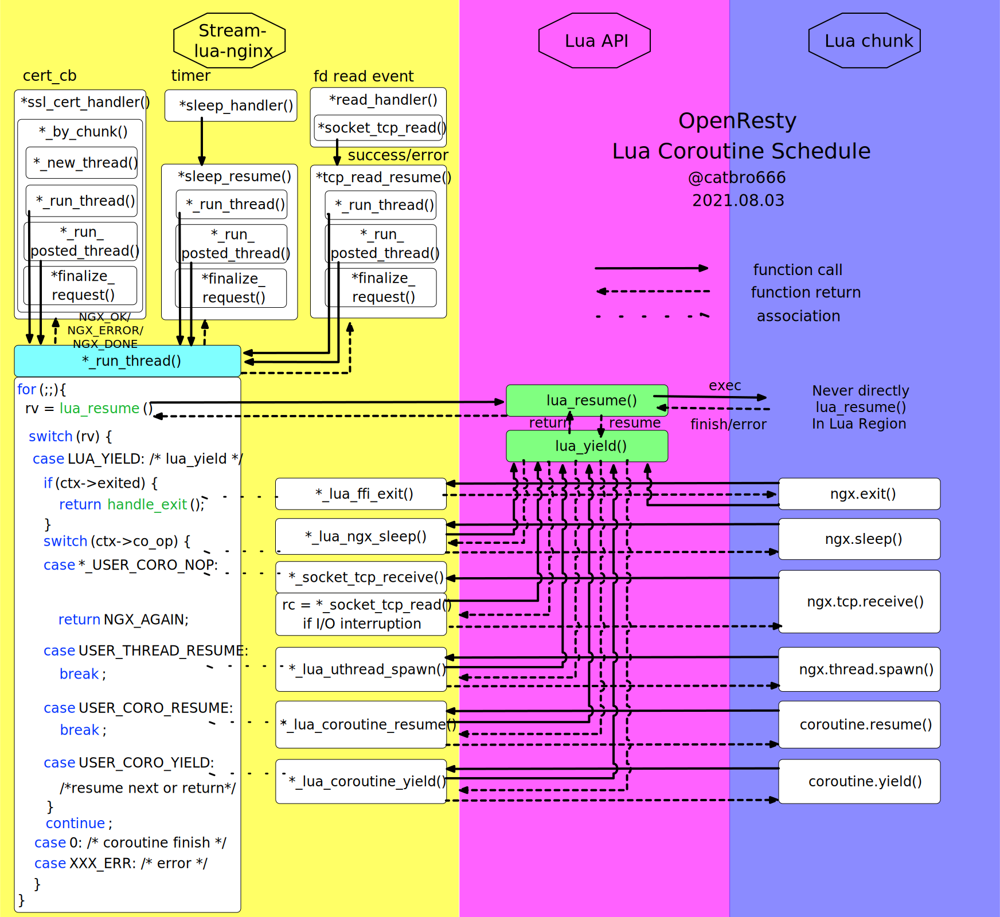
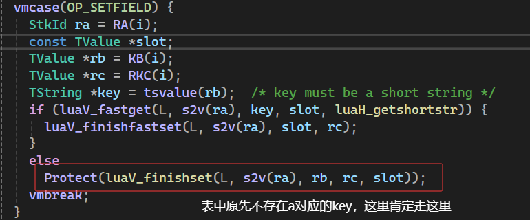
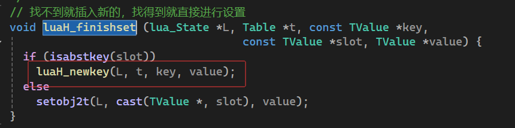
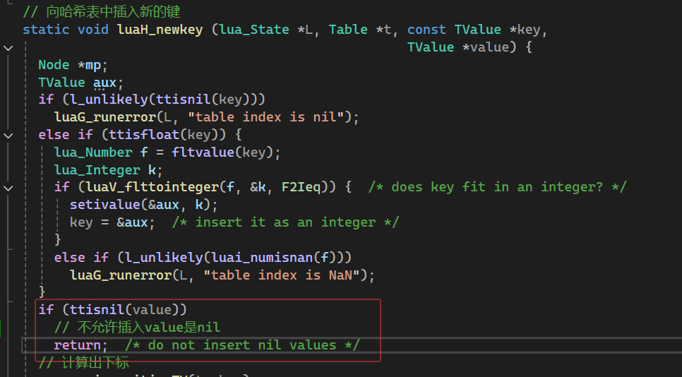

1. Nginx整体架构图
   


2. Nginx模块化设计


3. Nginx执行阶段

    - postread - 读取请求行和请求头后的处理。
    - server-rewrite - 服务器级别的URL重写。
    - find-config - 寻找配置文件中的相关指令。
    - rewrite - 根据配置进行URL重写。
    - post-rewrite - 重写后的处理。
    - preaccess - 访问权限前的检查。
    - access - 访问权限控制。
    - postaccess - 访问权限控制后的处理。
    - try-files - 尝试访问文件或目录。
    - content - 内容生成阶段。
    - log - 日志记录阶段。
  
4. OpenResty执行阶段, lua-nginx-module 以第三方模块的方式嵌入到 Nginx 的各个执行阶段里。
   


5. Lua协程和Nginx事件机制相互配合


6. 原生Lua coroutine接口
>我们知道Lua是个非常轻巧的语言，它不像Go有自己的调度器。Lua原生的对协程的操作无非就是coroutine.resume()和coroutine.yield()。这两者是成对出现的，协程coroutine.yield()之后肯定回到父协程coroutine.resume()的地方，恢复子协程需要显式再次coroutine.resume()。如果要在Lua代码层面实现非阻塞I/O，那么父协程必须处理子协程I/O等待的情况，并在事件发生时恢复子协程的执行。如果需要同时进行多个任务，那么父协程就需要负责多个协程间的调度。因为协程的拓扑可能是一个复杂的树状结构，所以协程的调度管理将变得异常复杂。

7. ngx.thread.spawn
> 什么是“轻线程”？
> 
> “轻线程”是 OpenResty 框架的核心，它是一种特殊的 Lua 协程，由 ngx_lua 模块进行调度，用于高效地处理非阻塞 I/O 操作。它不是传统的操作系统线程。
>
> 执行模型
>
> 当你调用 ngx.thread.spawn(func, ...) 时，func 会同步开始执行，直到它完成、遇到 Lua 错误或因非阻塞 I/O 操作而让出执行权。ngx.thread.spawn 函数返回后，“轻线程”会进入异步运行模式，由 ngx_lua 调度器管理。
>
> 线程类型
>
> 入口线程：Nginx 为每个请求处理程序（如 rewrite_by_lua）自动创建的主“轻线程”。
>
> 用户“轻线程”：你通过 ngx.thread.spawn 显式创建的“轻线程”。这两种线程都可以创建新的“轻线程”。
>
> 调度方式
> 
> “轻线程”是非抢占式调度的，它只在两种情况下放弃 CPU：
>
> 1.当非阻塞 I/O 操作（如 tcpsock:receive）无法立即完成时。
>
> 2.当你手动调用 coroutine.yield() 时。
>
> 终止与错误处理
> 
> 一个 Nginx 请求处理程序只有在所有相关的“轻线程”都终止后才会结束。
> 如果一个用户“轻线程”因 Lua 错误而终止，它不会影响其他正在运行的“轻线程”。
> 但如果入口线程因 Lua 错误或“终止世界”的调用（如 ngx.exit）而终止，它会中止所有其他正在运行的用户“轻线程”。
>
> 父子关系
> 
> 创建新“轻线程”的协程（无论是普通 Lua 协程还是另一个“轻线程”）被称为它的父协程。
> 
> 父协程可以使用 ngx.thread.wait 暂停自身执行，来等待其子“轻线程”完成。  
>
> “僵尸”状态
> 如果一个“轻线程”在满足以下三个条件时，它会进入“僵尸”状态：
> 
> 1.它已经终止（无论成功还是失败）。
> 
> 2.它的父协程仍然存活。
> 
> 3.它的父协程没有使用 ngx.thread.wait 来等待它。
> 
> 处于“僵尸”状态的线程，虽然已经完成任务，但仍占用着内存资源，等待父协程的“回收”。或者等待父协程本身终止，之后它才会被完全清理。
```lua
-- 入口"线程"使用轻量级"线程"

local yield = coroutine.yield

function f()
    local self = coroutine.running()
    ngx.say("f 1")
    yield(self)
    ngx.say("f 2")
    yield(self)
    ngx.say("f 3")
end

local self = coroutine.running()
ngx.say("0")
yield(self)

ngx.say("1")
ngx.thread.spawn(f)

ngx.say("2")
yield(self)

ngx.say("3")
yield(self)

ngx.say("4")

--[[
0
1
f 1
2
f 2
3
f 3
4
]]


-- 一个nginx请求中对 MySQL、Memcached 和上游 HTTP 服务进行并行请求，并按照实际返回的顺序输出结果
-- query mysql, memcached, and a remote http service at the same time,
-- output the results in the order that they
-- actually return the results.

local mysql = require "resty.mysql"
local memcached = require "resty.memcached"

local function query_mysql()
    local db = mysql:new()
    db:connect{
                host = "127.0.0.1",
                port = 3306,
                database = "test",
                user = "monty",
                password = "mypass"
            }
    local res, err, errno, sqlstate =
            db:query("select * from cats order by id asc")
    db:set_keepalive(0, 100)
    ngx.say("mysql done: ", cjson.encode(res))
end

local function query_memcached()
    local memc = memcached:new()
    memc:connect("127.0.0.1", 11211)
    local res, err = memc:get("some_key")
    ngx.say("memcached done: ", res)
end

local function query_http()
    local res = ngx.location.capture("/my-http-proxy")
    ngx.say("http done: ", res.body)
end

ngx.thread.spawn(query_mysql)      -- create thread 1
ngx.thread.spawn(query_memcached)  -- create thread 2
ngx.thread.spawn(query_http)       -- create thread 3
```

8. Openresty实现了自己的协程调度器，转自[Openresty Lua协程调度机制](https://catbro666.github.io/posts/150430f0/)
> OR在对协程调度上，最核心的改动是其创建新协程时的行为（coroutine.resume(), ngx.thread.spawn()）。它不会直接调用lua_resume()，而是先lua_yield()回到主线程，然后由主线程再根据情况lua_resume()下一个协程。Lua代码域内从来不会直接调用lua_resume()，理解了这一点你就理解了OpenResty协程调度的精髓。
 


9. ngx.null,cdata:NULL和cjson.null为什么不直接用lua中的nil
    - ngx.null，比如redis操作
    ```lua
    local res, err = red:get("dog")
    if res ~= ngx.null then
        res = res + "test"
    end
    ```
    - cdata:NULL， LuaJIT FFI接口去调用C函数，而这个函数返回一个NULL指针
    - cjson.null，json中的null
    ```json
    {
    "success": true,
    "data": {
        "user": {
        "id": 123,
        "premiumMember": null
        }
    },
    "error": null
    }
    ```

nil在lua中有特殊的意义，如果一个变量被设置为nil相当于告知该变量未定义(不存在)一样，ngx.null和cjson.null表示的是为空，还有一个原因，在lua中表中**新建**一个key但是对应的val确实nil，这是无效的，可以看下面源码
```lua
local t = {}
t.a = nil
```




10. OpenResty 中 Lua 变量的范围
    - 全局变量
    > 在 OpenResty 里面，只有在 init_by_lua* 和 init_worker_by_lua* 阶段才能定义真正的全局变量。 这是因为其他阶段里面，OpenResty 会设置一个隔离的全局变量表，以免在处理过程污染了其他请求。 即使在上述两个可以定义全局变量的阶段，也尽量避免这么做。全局变量能解决的问题，用模块变量也能解决， 而且会更清晰、更干净。
    - 模块变量
    > 这里把定义在模块里面的变量称为模块变量。无论定义变量时有没有加 local，有没有通过 _M 把变量引用起来， 定义在模块里面的变量都是模块变量。
    由于 Lua VM 会把 require 进来的模块缓存到 package.loaded 表里，除非设置了 lua_code_cache off， 模块里定义的变量都会被缓存起来。而且重要的是，模块变量在每个请求中是共享的。
    ```lua
    -- nginx.conf
    -- location = /index {
    -- content_by_lua_file conf/lua/web/index.lua;
    -- }

    -- index.lua
    local var = require "var"

    if var.calc() == 1 then
        ngx.say("ok")
    else
        ngx.status = ngx.HTTP_INTERNAL_SERVER_ERROR
        ngx.say("error")
    end

    -- var.lua
    local count = 1

    local _M = {}

    local function add()
        count = count + 1
    end

    local function sub()
        count = count - 1
    end

    function _M.calc()
        add()
        -- 模拟协程调度
        ngx.sleep(ngx.time()%0.003)
        sub()
        return count
    end

    return _M
    ```
    - 本地变量
    > 跟全局变量、模块变量相对，这里我们姑且把 *_by_lua* 里面定义的变量称之为本地变量。 本地变量仅在当前阶段有效，如果要跨阶段使用，需要借助 ngx.ctx 或者附加在模块变量里。

11. Openresty性能优化
- 避免使用阻塞操作
- table.new(narray, nhash)
- 优先使用OpenResty的正则

12. 